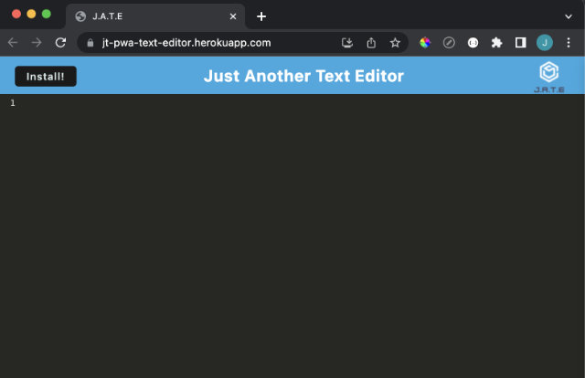
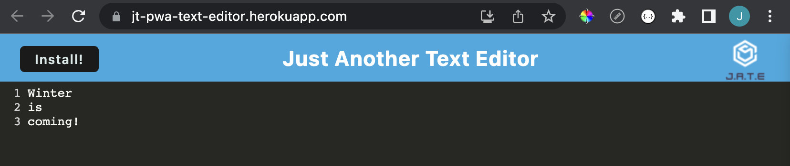
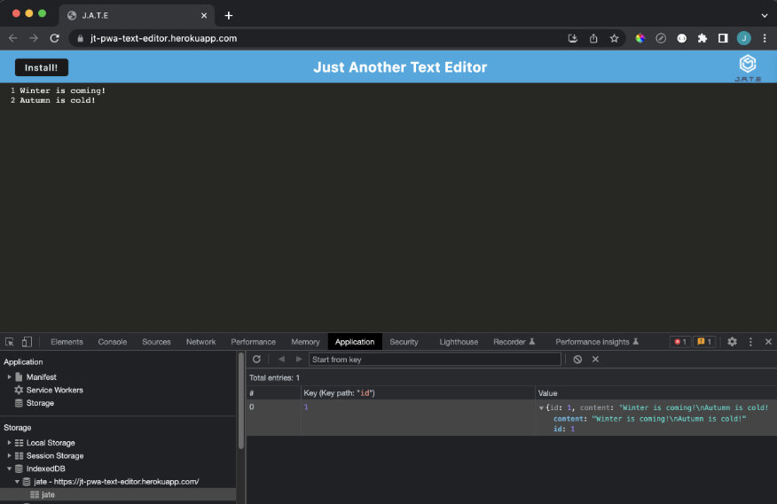
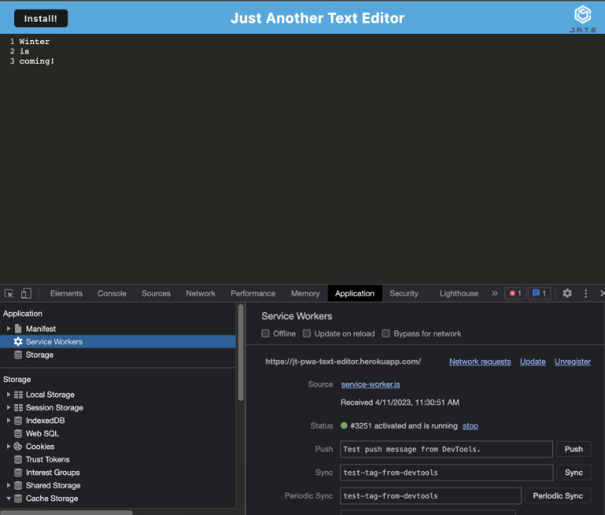
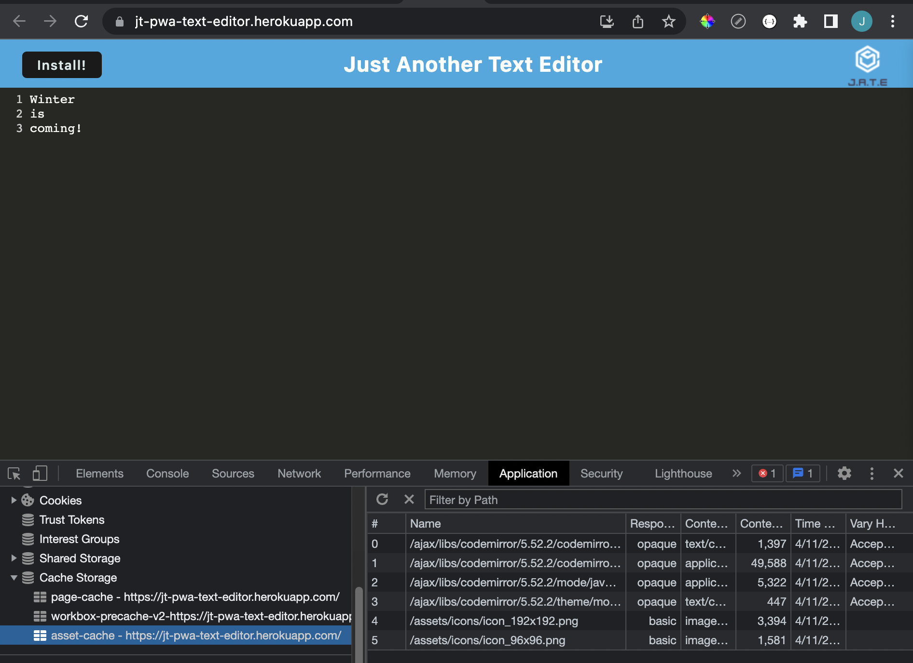
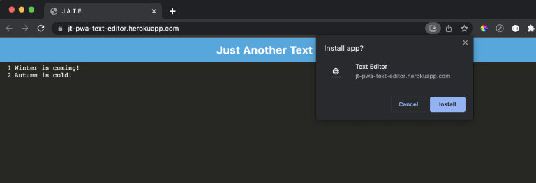
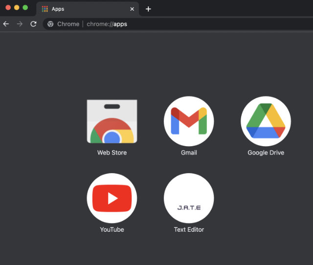
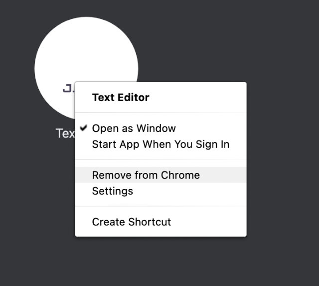
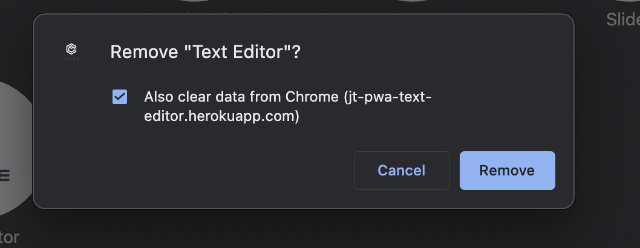

# **PWA Text Editor

## **Project Description**

This progressive web application (PWA) is an online text editor that leverages CodeMirror and Webpack to provide a seamless user experience, automatically storing content to the client-side IndexedDB storage for offline access.

---
## **URLs**
- [Deployed Application](https://jt-pwa-text-editor.herokuapp.com/)
- [GitHub Repository URL](https://github.com/jouriena11/text-editor-PWA)

---
## **Table of Contents**
- [Installation](#localhost-installation)
- [Technologies Used](#technologies-used)
- [Usage](#usage)
- [Future Developments](#future-development)

---
## **Localhost Installation**
The following npm libraries must be installed to run this application in your local directory:

1. At `root` directory:
- dependencies
    - express v4.17.1
    - if-env v1.0.4

- devDependencies
    - concurrently v5.2.0

2. At `client` directory:
- dependencies
    - code-mirror-themes v1.0.0
    - idb v6.1.2
    - idb-keyval v6.2.0

- devDependencies
    - @babel/core v7.15.0
    - @babel/plugin-transform-runtime v7.15.0
    - @babel/preset-env v7.15.0
    - @babel/runtime v7.15.3
    - babel-loader v8.2.2
    - css-loader v6.2.0
    - html-webpack-plugin v5.3.2
    - http-server v0.11.1
    - mini-css-extract-plugin v2.7.5
    - style-loader v3.2.1
    - webpack v5.51.1
    - webpack-cli v4.8.0
    - webpack-dev-server v4.0.0
    - webpack-pwa-manifest v4.3.0
    - workbox-webpack-plugin v6.2.4

3. At `server` directory:
- dependencies
    - express v4.17.1
- devDependencies:
    - nodemon v2.0.4

These installations can be done conveniently by the running the following command line at each of these directories:

```
npm i
```

---
## **Technologies Used**
- JavaScript
- CSS
- Node.js
- Express.js
- Webpack - for bundling of files (including JavaScript, CSS, images, etc)
- Workbox - for generating service worker that handles precaching
- IndexedDB - a client-side database
- Babel -  a JavaScript compiler that that converts JavaScript into a backward-compatible version so that the codes can be run in older web browsers 
- CodeMirror - a web-based text editor

---
## **Usage**

To use this text editor app, follow these steps

1. **Running the app**
    - <u>***Running the app in local computer***</u>: First run `npm run start` in a command-line interface (CLI), then open a browser and enter `http://localhost:3000/` in the address bar.

    - <u>***Running the app deployed on Heroku***</u>: Click on the deployed application link in URL section above, and you'll be taken to the deployed application page.

        

2. Enter your (sample) content in the text editor
    
    

3. Switch to another browser window or tab

4. Reload the page and you'll see that your content is still present in the text editor

5. Regardless of where you're running the app, go to the following Chrome Inspect (i.e. `right-click > inspect` or  `cmd + option + i` on macOS) tabs to check if the app is running properly:

    - `Application > IndexedDB > jate > jate`: check here to see if any update in the text editor is saved to this client-side storage. Make sure to click the update button from here after updating the content in text editor

        <br><br>

    - `Application > Service Works`: check here to see if a service worker is registered, activated, and running

        <br><br>

    - `Application > Cache Storage`: check here to see if precached assets have been stored

        <br><br>

6. Click the 'Install!' button to install the app to your local computer. A window prompt would appear when you click the button. Click 'Install' to confirm the local installation.

    <br><br>

7. Once the installation is complete, (1) The PWA app would be automatically activated and (2) the web app would be automatcially closed, and (3) the 'Install!' button would be hidden. You can do Chrome Inspect on the locally run app as mentioned above.

    Once you close the PWA app, and want to run the app again, open Chrome and enter `chrome://apps` in the address bar, and you'll see the installed app.<br><br>
    
    <br><br>

    And if you want to uninstall the app, please make sure to uninstall it from Chrome Apps (otherwise, the 'Install!' functionality would not work again due to improper uninstallation).

    This can be done by<br>
    (1) Right-clicking the app
    (2) Choose `Remove from Chrome`
    (3) Select `Also clear data from Chrome...`
    (4) Click `Remove`
    <br><br>
    <br><br>
    

---
## **Future Development**
- Bug fix: to get offlineFallback() plugin to work